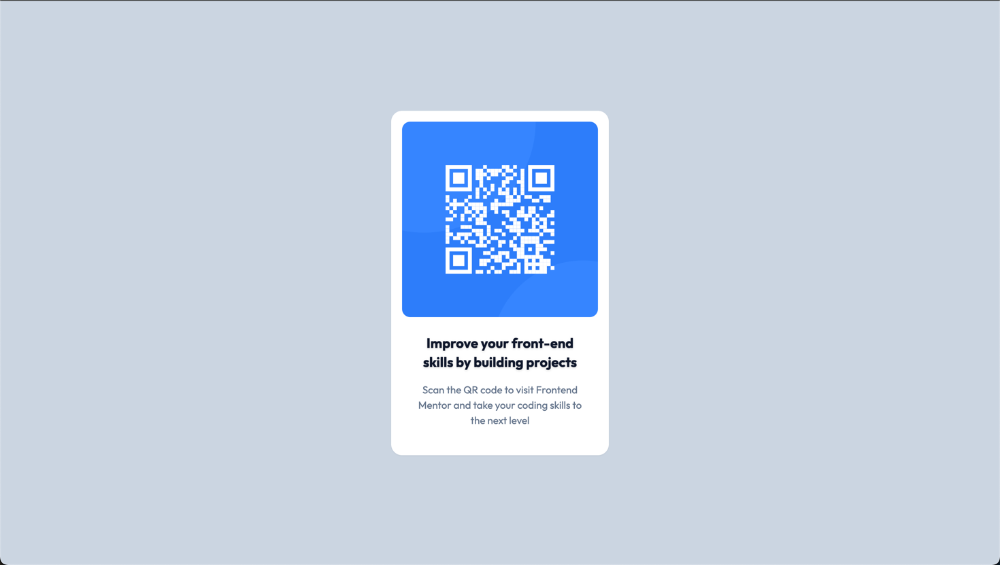

# Frontend Mentor - QR code component solution

This is a solution to the [QR code component challenge on Frontend Mentor](https://www.frontendmentor.io/challenges/qr-code-component-iux_sIO_H). Frontend Mentor challenges help you improve your coding skills by building realistic projects. 

## Table of contents

- [Overview](#overview)
  - [Screenshots](#screenshot)
  - [Links](#links)
- [My process](#my-process)
  - [Built with](#built-with)
  - [What I learned](#what-i-learned)
- [Author](#author)

## Overview

### Screenshots

### Links

- Solution URL: [Github](https://github.com/csmateixeira/qr-code-component)
- Live Site URL: [Vercel Deployment](https://qr-code-component-psi-six.vercel.app/)

## My process

### Built with

- [Tailwindcss](https://tailwindcss.com/) V3
- NPM

### What I learned

Learned the very basics of Tailwindcss and the concept of flex boxes. Also learned how to use Vercel to deploy my projects.

## Author

- Frontend Mentor - [@csmateixeira](https://www.frontendmentor.io/profile/csmateixeira)
